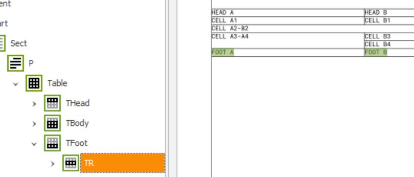

# fop-pdf-ua-table-tagging-issue
This project is just to demonstrate tagging problems with tables in the PDF/UA-1 mode of FOP.

Content is:

* a minimal table as XSL-FO document: [table.fo](table.fo)
* A FOP config with `PDF/UA-1` mode *inactive*: [config/fop-config.xml](config/fop-config.xml)
* A FOP config with `PDF/UA-1` mode *active*: [config/fop-config-ua.xml](config/fop-config-ua.xml)
* A FOP config with `PDF/UA-1` mode *inactive* but forcing PDF 1.4: [config/fop-config14.xml](config/fop-config14.xml)
* A GitHub workflow which calls FOP via Maven to generate PDFs from the `table.fo`:
    * One PDF with the `fop-config.xml`: [out/table.pdf](out/table.pdf)
    * One PDF with the `fop-config-ua.xml`: [out/table-ua.pdf](out/table-ua.pdf)
    * One PDF with the `fop-config14.xml`: [out/table14.pdf](out/table14.pdf)
* Screenshots from the logical structure view of the PAC of all results:
    * [out/table.jpg](out/table.jpg)
    * [out/table-ua.jpg](out/table-ua.jpg)
    * [out/table-14.jpg](out/table-14.jpg)
    
    
Comparing the screenshots makes the issue clear:

| Inacitve | Active | PDF 1.4 |
|---|---|---|
|  |  |  |

You see that if the `PDF/UA-1` mode is **active** the tagging of `TBody`, `THead` and `TFoot` are lost and the `TFoot` row is missplaced.

The reason for adding the PDF 1.4 version was, that PDF 1.4 knows only the tags `Table`, `TR`, `TH` and `TD`  (See [PDF 1.4 specification](https://opensource.adobe.com/dc-acrobat-sdk-docs/pdfstandards/pdfreference1.4.pdf) Table 9.22). With PDF 1.5 `TBody`, `THead` and `TFoot` was introduced (see [PDF 1.5 specification](https://opensource.adobe.com/dc-acrobat-sdk-docs/pdfstandards/pdfreference1.5_v6.pdf) Table 10.22).

**Conclusion:** FOP tags tables in PDF 1.4 style if PDF/UA-1 mode is active. If PDF/UA-1 mode is inactive it tags tables in PDF 1.5 style even if PDF 1.4 is generated.

