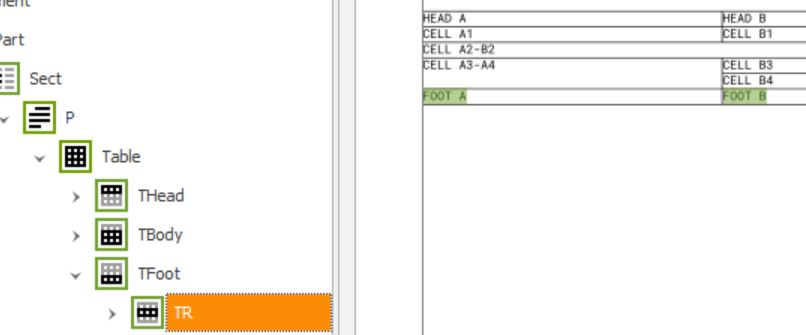
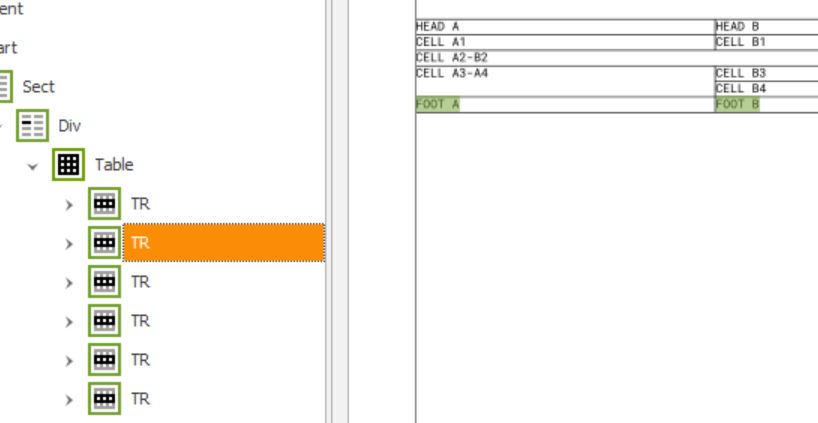

# fop-pdf-ua-table-tagging-issue
This project is just to demonstrate tagging problems with tables in the PDF/UA-1 mode of FOP.

Content is:

* a minimal table as XSL-FO document: [table.fo](table.fo)
* A FOP config with `PDF/UA-1` mode *inactive*: [config/fop-config.xml](config/fop-config.xml)
* A FOP config with `PDF/UA-1` mode *active*: [config/fop-config-ua.xml](config/fop-config-ua.xml)
* A GitHub workflow which calls FOP via Maven to generate PDFs from the `table.fo`:
    * One PDF with the `fop-config.xml`: [out/table.pdf](out/table.pdf)
    * One PDF with the `fop-config-ua.xml`: [out/table-ua.pdf](out/table-ua.pdf)
* Screenshots from the logical structure view of the PAC of both results:
    * [out/table.jpg](out/table.jpg)
    * [out/table-ua.jpg](out/table-ua.jpg)
    
    
Comparing the screenshots makes the issue clear:

| Inacitve | Active |
|---|---|
|  |  |

You see that if the `PDF/UA-1` mode is **active** the tagging of `TBody`, `THead` and `TFoot` are lost and the `TFoot` row is missplaced.